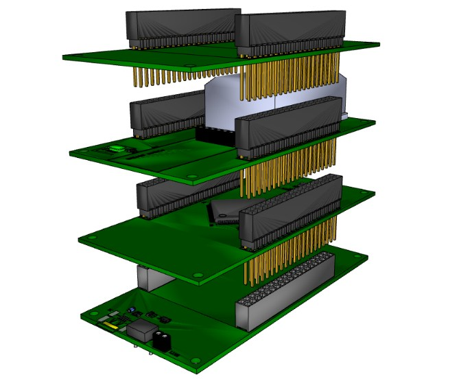
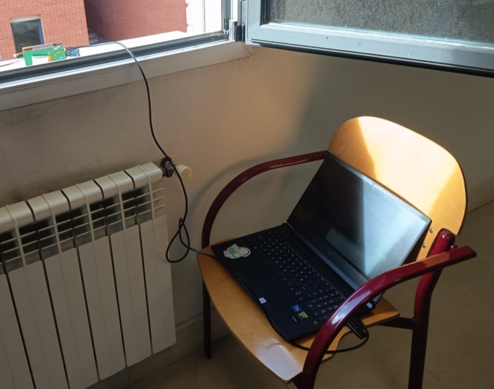
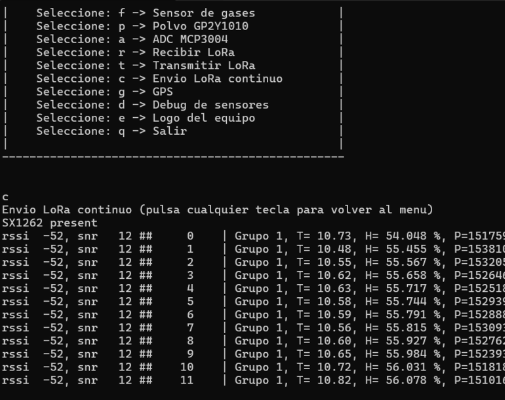
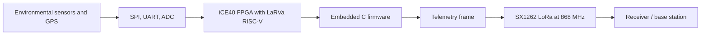
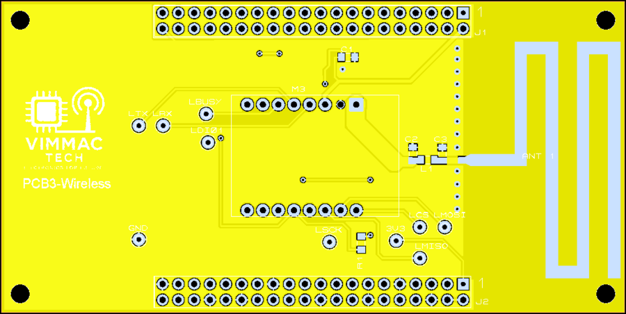

# LoRa Environmental Datalogger

An end-to-end IoT datalogger prototype that measures environmental data, processes it on an FPGA-based RISC-V system, and sends telemetry through a LoRa radio link at 868 MHz.

The project covers the complete engineering path: system architecture, custom PCB design, FPGA peripherals, embedded C firmware, sensor acquisition, LoRa communication, RF antenna design, fabrication files, and field validation.

<p align="center">
  
</p>

## What It Does

The datalogger is a compact sensor node inspired by radiosonde-style payloads. It collects environmental and location data, formats the measurements into telemetry frames, and transmits them wirelessly to a receiver or base station.

In practice, the system can:

- Read temperature, humidity, pressure, gas, dust, and GPS data.
- Digitize analog sensors through an MCP3004 ADC.
- Run the control logic on a LaRVa RISC-V soft core implemented inside a Lattice iCE40 FPGA.
- Communicate with sensors and the radio through SPI and UART peripherals implemented in Verilog.
- Transmit and receive LoRa packets using an SX1262 module at 868 MHz.
- Validate the RF path with a PCB-integrated antenna and external antenna options.

<p align="center">
  
  
</p>

## System Architecture

The prototype is split into four stacked PCBs. Each board has a clear role, which keeps the system modular and easier to test.

| Board | Role | Main Contents |
| --- | --- | --- |
| PCB0 - Power and programming | Powers and programs the system | USB input, battery charging, 3.3 V regulation, USB-UART/debug interface |
| PCB1 - FPGA control | Runs the digital system | Lattice iCE40HX4K FPGA, external flash, RISC-V soft core, Verilog peripherals |
| PCB2 - Sensors | Interfaces with the physical world | BME680, GPS TEL0132, MQ-9 gas sensor, GP2Y1010 dust sensor, MCP3004 ADC |
| PCB3 - Wireless | Handles radio communication | SX1262 LoRa module, 868 MHz RF path, matching network, PCB antenna, external antenna option |

Data flows through the system like this:



## Hardware Design

The hardware was designed as a real manufacturable device, not only as a schematic exercise.

Key hardware work includes:

- A four-board stacked mechanical and electrical architecture.
- Proteus schematic capture and PCB layout.
- Custom footprints for non-standard parts and the PCB antenna.
- Gerber fabrication packages for the four boards.
- Power and thermal estimation spreadsheets.
- Ground-plane, routing, and connector planning for a compact stacked system.
- PCB3 fabrication and assembly focused on the LoRa communication path.

<p align="center">
  
</p>

The RF board uses a Semtech SX1262-based LoRa module and supports both an integrated folded monopole antenna and external antenna testing. The antenna path was designed around a 50 ohm RF line and a matching network so the real board could be tuned after fabrication.

## FPGA And Soft-Core System

The digital platform is built around LaRVa, a small RISC-V soft core implemented in Verilog and extended for this datalogger.

The FPGA system includes:

- 16 KB internal RAM initialized with the firmware image.
- Three UART peripherals:
  - UART0 for console/debug.
  - UART1 for the GPS module.
  - UART2 reserved for auxiliary serial communication.
- Two SPI masters:
  - SPI0 for the BME680 sensor and MCP3004 ADC.
  - SPI1 for the SX1262 LoRa radio.
- Timer peripheral for delays, timeouts, and sensor timing.
- GPIO output control for sensor power, LoRa reset, LoRa TX/RX switching, and status LEDs.
- GPIO input lines for LoRa BUSY and DIO1 status.
- Interrupt support for timer and UART receive/transmit events.

The main Verilog entrypoints are:

- `Software/laRVa_tp1_G1/main.v` - top-level FPGA wiring and board pins.
- `Software/laRVa_tp1_G1/system.v` - memory map, RAM, UARTs, SPIs, timer, GPIO, and interrupt logic.
- `Software/laRVa_tp1_G1/laRVa.v` - RISC-V CPU core.
- `Software/laRVa_tp1_G1/pines.pcf` - FPGA pin constraints.

## Firmware

The firmware is written in freestanding C for the RISC-V soft core. It exposes a UART console menu that can run individual sensor tests, read raw ADC channels, parse GPS data, transmit LoRa packets, receive LoRa packets, or continuously stream telemetry.

Main firmware capabilities:

- BME680 driver for temperature, humidity, and pressure compensation.
- MCP3004 ADC driver for single-ended, differential, and multi-channel reads.
- MQ-9 gas sensor conversion for CO and CH4 estimation.
- GP2Y1010 dust sensor timing and ADC capture.
- TEL0132 GPS reader with NMEA GGA parsing and decimal coordinate conversion.
- SX1262 LoRa driver with radio reset, SPI register access, TX/RX modes, RSSI/SNR status, and configurable frequency, bandwidth, and spreading factor.
- Continuous telemetry mode that sends one LoRa frame per second.

The interactive firmware menu supports:

| Command | Function |
| --- | --- |
| `s` | Read BME680 temperature, pressure, and humidity |
| `f` | Read MQ-9 gas values |
| `p` | Read GP2Y1010 dust sensor ADC value |
| `a` | Read all MCP3004 ADC channels |
| `g` | Read GPS NMEA data |
| `t` | Transmit one LoRa packet |
| `r` | Receive LoRa packets |
| `c` | Continuously transmit telemetry frames |
| `d` | Run a full sensor debug readout |

## Repository Map

```text
.
+-- Hardware/
|   +-- TP1_G1.pdsprj                         # Proteus hardware project
|   +-- Ficheros Gerber/                      # Fabrication ZIPs for PCB0-PCB3
|   +-- Imagenes esquematicos y PCBs/         # Board renders and PCB PDFs
|   +-- Analisis electrico y termico files    # Power and thermal spreadsheets
+-- Software/
|   +-- laRVa_tp1_G1/
|       +-- main.v                            # FPGA top module
|       +-- system.v                          # LaRVa SoC and peripherals
|       +-- laRVa.v                           # RISC-V soft core
|       +-- uart.v, spi.v, timer.v            # Verilog peripherals
|       +-- pines.pcf                         # FPGA constraints
|       +-- Firmware/
|           +-- main.c                        # Application firmware and console menu
|           +-- moduloBME680.*                # Environmental sensor driver
|           +-- moduloMCP3004.*               # ADC driver
|           +-- moduloMQ9.*                   # Gas sensor driver
|           +-- moduloGP2Y1010.*              # Dust sensor driver
|           +-- moduloTEL0132.*               # GPS/NMEA driver
|           +-- lora_sx1262.*                 # SX1262 LoRa driver
+-- Planificacion/
|   +-- BOM/                                  # Bill of materials material
|   +-- Words/                                # Planning and report source files
+-- Control_cambios/                          # Hardware, software, planning, and docs logs
+-- docs/assets/readme/                       # Curated README images
```

## Build And Programming Flow

The checked-in build flow targets the original bundled toolchain layout under `Software/tools_viejas/`.

From `Software/laRVa_tp1_G1/`:

```bash
make sim       # Build and run the Verilog testbench, then open GTKWave
make main.bin  # Synthesize, place and route, and create the FPGA bitstream
make burn      # Program the FPGA through the original loader flow
```

From `Software/laRVa_tp1_G1/Firmware/`:

```bash
make           # Build the RISC-V firmware image code.bin
```

Notes:

- The Makefiles use the original Windows-style bundled tools and paths.
- On macOS or Linux, update the tool paths and executable names before running the build flow directly.
- The generated firmware binary is converted into `rom.hex` and injected into the FPGA RAM image during bitstream generation.

## Validation

The project was validated at several levels:

- PCB design review and Gerber generation for all four boards.
- PCB3 fabrication, assembly, and RF path inspection.
- Antenna characterization around the 868 MHz target band.
- FPGA peripheral integration for UART, SPI, timer, GPIO, and interrupts.
- Sensor driver tests through the UART console.
- GPS NMEA parsing and coordinate extraction.
- LoRa transmit/receive tests with SX1262 modules.
- Continuous telemetry frames including sensor values and radio status such as RSSI and SNR.

## What This Project Shows

This repository is useful as an engineering portfolio project because it combines several layers that are often developed separately:

- Embedded C on a constrained RISC-V soft core.
- FPGA peripheral design in Verilog.
- Sensor integration across SPI, UART, GPIO, and ADC interfaces.
- RF-aware PCB design for a real LoRa link.
- Hardware manufacturing files and board-level validation.
- System-level debugging from schematic to wireless telemetry.

## Future Improvements

Possible next steps:

- Tune the PCB3 matching network with a more systematic component sweep.
- Reduce power consumption with deeper sleep states and duty-cycled sensing.
- Add packet CRC/application framing in the telemetry payload.
- Integrate with a LoRaWAN gateway or cloud backend.
- Add a polished receiver dashboard for live environmental monitoring.
- Iterate the enclosure and connectors for outdoor field tests.
